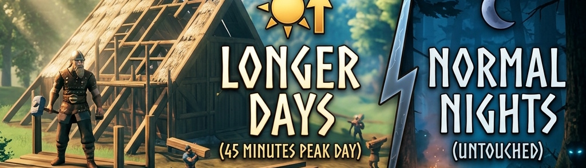

# Longer Days - Normal Nights

Extends the bright in-game midday to **3x its vanilla length**, creating a perfect 60-minute daily loop. Dawn, dusk, and night durations remain completely untouched—no extra time spent waiting in the dark!

## Features

- **3x Peak Daylight:** Extends the bright midday sun (6:00 to 18:00) from 15 minutes to **45 minutes** of real-time. Plenty of time for massive building projects and long crypt runs.
- **Vanilla Dawn, Dusk & Nights:** Twilight phases and nights remain exactly at their standard durations (15 minutes combined). You keep the full immersive atmosphere without the boring, stretched-out nights.
- **Perfect 1-Hour Cycle:** The total day/night loop lasts exactly 60 minutes, making it incredibly easy to track time.
- **Zero Performance Impact:** Highly optimized, ultra-lightweight guard clauses with zero overhead. 
- **Plug & Play:** Zero configuration needed.

## Multiplayer Note

Time scale is synchronized via the server network traffic. If playing in multiplayer, **this mod must be installed on both the server and all clients** to prevent day/night desynchronization.

## Installation

- [Download on **Nexus Mods**](https://www.nexusmods.com/valheim/mods/3439)
